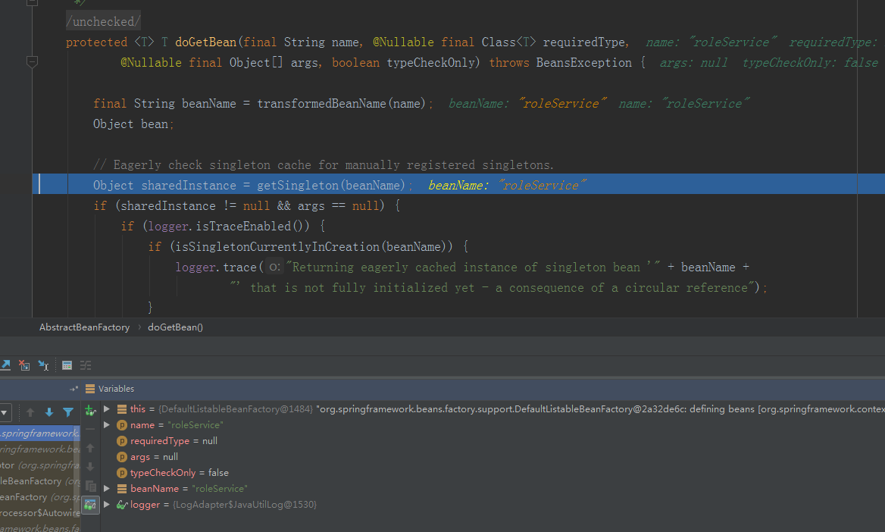
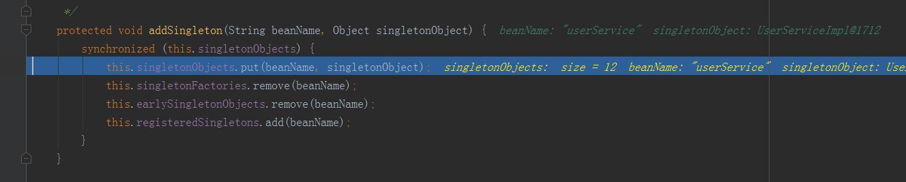

# 第1章. 如何理解Spring的循环依赖

其实，不分场景地、笼统地说**A依赖B**其实是不够准确、至少是不够细致的。我们可以简单定义一下什么是**依赖**。所谓**A依赖B**，可以理解为A中某些功能的实现是需要调用B中的某些功能配合实现的。这里也可以拆分为两层含义：

1. **A强依赖B**。创建A的实例这件事情本身需要B来参加。我们可以将A看做现实生活中的儿子，B看做是现实生活中的妈妈。儿子要出生，必须妈妈首先是生活在这个世界上的。
2. **A弱依赖B**。创建A的实例这件事情不需要B来参加，但是A中某些功能的实现是需要调用B中的某些功能配合实现的。对照在现实生活就像**男耕女织**一样。

那么，所谓**循环依赖**，其实也有两层含义：

a. 弱依赖之间的循环依赖。如下代码所示：

```java
@Service
public class UserServiceImpl implements UserService {

    @Autowired
    private RoleService roleService;

}

@Service
public class RoleServiceImpl implements RoleService {

    @Autowired
    private UserService userService;

}
```

b. 强依赖之间的循环依赖。这个暂时我先不讲，后面再分析。


# 第2章. 弱依赖之间的循环依赖

## 1. 如何解决 UserService 与 RoleService 之间的循环依赖 ？

具体代码依赖如下，那么 Spring 是如何解决这个依赖的呢？
具体代码可以参考 spring-circular-reference-debug-test1 这个工程。

```java
@Service
public class UserServiceImpl implements UserService {

    @Autowired
    private RoleService roleService;

}

@Service
public class RoleServiceImpl implements RoleService {

    @Autowired
    private UserService userService;

}
```

可以看到，这里UserService和RoleService中各自都以对方为自己的全局属性。这里首先需要说明的一点是，Spring实例化bean是通过ApplicationContext.getBean()方法来进行的。如果要获取的对象依赖了另一个对象，那么其首先会创建当前对象，然后通过递归的调用ApplicationContext.getBean()方法来获取所依赖的对象，最后将获取到的对象注入到当前对象中。

## 1.1 调试源码

步骤一：在这里我们发现，Spring 首先去获取 RoleService 的实例。那么它要去哪个地方去获取呢？请接着往下看 getBean(String name) 的逻辑。


步骤二：当我们进入到 getBean(String name) 的时候，发现这是一个空壳的方法，它又调用了 doGetBean(String name, final Class<T> requiredType,final Object[] args, boolean typeCheckOnly) 的方法，要记住一点，Spring里面干实事的方法都是以do开头的方法。


步骤三：当我们进入到 doGetBean(String name, final Class<T> requiredType,final Object[] args, boolean typeCheckOnly) 方法的时候，仔细看，它会调用一个 getSingleton(String beanName)的方法，顾名思义，这个方法就是根据beanName去获取bean实例，那么它又是去哪里拿呢？再接着往下看。


步骤四：我们进入到getSingleton(String beanName)的方法，发现他还是一个空壳方法，它调用了getSingleton(String beanName, boolean allowEarlyReference) 方法，注意这个方法的第二个参数，**允许暴露早期对象**，什么意思呢？在这里，你先可以不用去理会它，在文章的后面，我会去解释的。


步骤五：我们进入到getSingleton(String beanName, boolean allowEarlyReference) 方法，你会发现他是去一个叫singletonObjects的里面去获取bean的实例，那么这个singletonObjects是何许人也呢？ 它就是我们的单例缓存池（也就是一级缓存），所有Spring实例化好的单例bean（什么叫实例化好的单例bean？也就是说走完了所有的生命周期的bean，完全可以暴露出去给应用程序使用的bean的实例）都是放在这里里面的。可以看到，singletonObjects里面根本就没有我们想要的roleService。很容易里面，这个时候singletonObjects肯定是没有我们想要的bean实例的。因为我们根本就还没有去实例化roleService，我们现在只是去尝试的获取它而已。因为Spring在实例化单例bean的时候遵循一个原则，那就是先尝试去获取，如果没有获取到，就去实例化这个bean。


步骤六：在这里，我们看到调用了isSingletonCurrentlyInCreation(String beanName)方法，这个方法就是去判断当前这个bean是不是正在创建中。很明显，我们这个bean肯定不在里面，因为我们根本还没有去实例化这个bean，目前我们所走的路，都只是尝试去获取这个bean的实例而已。


步骤七：这行代码返回的肯定是false，也就意味着这里代码直接返回了。


返回出去的singletonObject肯定是 null .


步骤八：到这里，getSingleton(beanName)这个方法已经在这个流程中被我们分析完了。


步骤九：既然我们从这个singletonObjects单例缓存池（也就是一级缓存）拿不到我们想要的bean的实例，也就说明我们想要的bean其实并没有被实例化。那么怎么办呢？ 我们只能去实例化我们想要的bean的实例了。


你会发现，在这里调用了getSingleton(String beanName, ObjectFactory<?> singletonFactory)方法，源码中是lamad表达式。这里是非常关键的。


我们进入到getSingleton(String beanName, ObjectFactory<?> singletonFactory)方法内部， 在这里接收的参数是一个lamad表达式，就是上图中我们看到的那个表达式。我们分析一下，在这个方法内部的逻辑。


从这里我们可以看到，Spring 还是 不死心，在它决定要去实例化roleService这个bean的时候，它还是要最后一次是尝试从singletonObjects单例缓存池（也就是一级缓存）去获取一次。很遗憾，还是没有获取到。


在它快要去实例化roleService这个bean的时候，它又要去做一件事。通过调用

beforeSingletonCreation(String beanName)这个方法去实现。那么这个方法到底是做什么的呢？接着往下看。


很简单，Spring在这里需要去做一个标记。什么标记呢？因为我马上要去创建roleService这个bean对象了，在我去实例化这个bean之前，我先把这个bean的名字记录在singletonsCurrentlyInCreation里面，表明这个bean目前正在创建中。


当执行到这里的时候，就是要创建我们的bean了。我们可以看到，singletonFactory是刚才我们传进来的那个lamad表达式，当调用这个lamad表达式的getObject()方法的时候。


实际上getObject()方法内部是会去执行createBean(beanName, mbd, args)方法的。


我们接下去继续看createBean(beanName, mbd, args)方法。当我们进去看的时候，发现里面调用了

doCreateBean(beanName, mbdToUse, args);


我们接着进去看doCreateBean(beanName, mbdToUse, args)方法。


doCreateBean(beanName, mbdToUse, args)方法内部调用了createBeanInstance(beanName, mbd, args)方法，我们再进去看。我们发现，在doCreateBean(beanName, mbdToUse, args)方法内部的最后一行调用了instantiateBean(beanName, mbd)去实例化roleService这个bean。我们再进去看。


通过观察，我们发现roleService这个对象已经被我们new出来了，只是里面的userService这个属性是null，还没有被我们赋值而已。


成功new出roleService这个对象之后，这个方法被返回，我们再次回到doCreateBean方法内部。如下：


很明显，earlySingletonExposure是true，因为现在roleService这个对象已经被我们new出来了，但是这个对象里面的属性都是null，我们称为这类对象为**早期对象**. Spring是如何处理这类早期对象的呢？Spring会将早期对象再次封装一下，放到singletonFactories里面去，singletonFactories俗称三级缓存。


接着程序执行addSingletonFactory(String beanName, ObjectFactory<?> singletonFactory)方法，注意这里又有一个lamad表达式。我们进入到方法内部。我们已经将早期对象放入到了singletonFactories中。


接下去，我们需要处理roleService这个对象中的属性的注入了，就是在这个方法中处理的。


我们进入到这个方法的内部。


解析过程如下：


我们再进入到metadata.inject(bean, beanName, pvs)方法内部继续查看。


我们继续进入查看。


到这里，似乎快看到希望了，继续进去查看。


再进去查看，如下图所示：


接下来，我们再继续查看doResolveDependency(descriptor, requestingBeanName, autowiredBeanNames, typeConverter)方法。在这里，找到了userService这个beanName所对应的Class文件的名字。


我们再继续往下看的时候，在这里已经很明显了。我们就是那userService这个bean的实例了。


我们进入到descriptor.resolveCandidate(autowiredBeanName, type, this)方法内部去看一下。


天啊，这段代码太熟悉了，getBean(String beanName), 接下来就和我们之前分析的套路是一样的。


是不是很熟悉。接下去我就不一步一步的debug下去了，往后我只关注核心的地方。userService这个bean在singletonObjects这个三级缓存中获取不到，并且singletonsCurrentlyInCreation里面也没有userService，因为我们至少到现在都还没有创建UserService这个bean的实例，所以返回null。


那么接下来就要创建UserService这个bean的实例对象了，创建过程和上面我们分析的是一模一样的。唯一不同的地方就是在处理依赖的时候。因为我们知道UserService也是依赖RoleService的。暂时我们先不管，我们先让代码执行到把UserService这个bean实例搞出来，然后我们之前在处理依赖的时候去debug，看下图。


我们知道，当前的bean的实例是userService，现在需要去依赖roleService。我们再进去看。


现在我们需要去拿roleService，这段代码太熟悉了。



我们又回到了这里，不过这次的处理就有点不一样了，我们进去看一下。


虽然我们没有从singletonObjects里面获取到roleService这个bean对象，但是这次逻辑会进入到 if 这个条件里面去。因为你们应该知道，singletonsCurrentlyInCreation里面是有 roleService 这个beanName的，你们应该知道，我们最开始是需要实例化roleService 的，实例化的过程发现依赖 userService。后来我们就又去实例化userService，而后又发现userService依赖roleSerivce，所以现在我们处在寻找roleService的这个bean的时间节点上。


从singletonObjects这个一级缓存中没有拿到，继而再从earlySingletonObjects这个二级缓存中去拿，还是没有拿到，所以就从singletonFactories这个三级缓存中去拿了。


我们已经从三级缓存中获取到这个roleService的bean的对象了，尽管这个bean对象里面的userService对象还是为null，不过没有关系。既然我们已经获取到了，就把这个早期对象放到earlySingletonObjects这个二级缓存中去，并从singletonFactories这个三级缓存中移除。


现在我们已经到roleService这个bean的对象获取到，并返回了。接下来要做的，就是将这个对象设置到userService这个bean对象里面去，请注意，现在我们仍然是处在实例化userService对象，并给userServce对象设置属性的过程中。


请注意，到这个地方的时候，userService的属性还是没有被设置进去的，不过执行完上面两行代码的时候，属性就被设置进去了。


请注意，现在userService的属性已经被设置进去了。现在userService这个bean对象算是搞完了，不过我们看到，roleService里面的属性还没有设置，接下去的流程就很简单了，和我们之前分析的是一模一样的。

到这里，我们的userService算是告一段落了。


现在实例化结束了，我们需要做一些收尾工作了。


我们进去看一下afterSingletonCreation(beanName)这个方法。很简单，这个方法就是将singletonsCurrentlyInCreation里面移除掉userService，因为它已经被实例化成功了，不再需要这个标志了。


接下来就是执行addSingleton(beanName, singletonObject)方法，很明显，就是将实例化好的对象放入到singletonObjects这个一级缓存中去。


我们进去看一下，它将userService这个bean对象放入到singletonObjects一级缓存，并从二级缓存earlySingletonObjects和三级缓存singletonFactories中移除这个bean。



真的快搞完了，，这么久了。现在UserService彻底结束。

请注意，现在roleService里面的属性还是null的。


不过当我们执行上面的两行代码。属性值就被设置进去了。


至此，循环依赖就分析完了。接下来的事情就和上面的一样，将roleService从singletonsCurrentlyInCreation中移除，并且将roleService放入到singletonObjects一级缓存，并从二级缓存earlySingletonObjects和三级缓存singletonFactories中移除这个bean。

分析到此结束。

